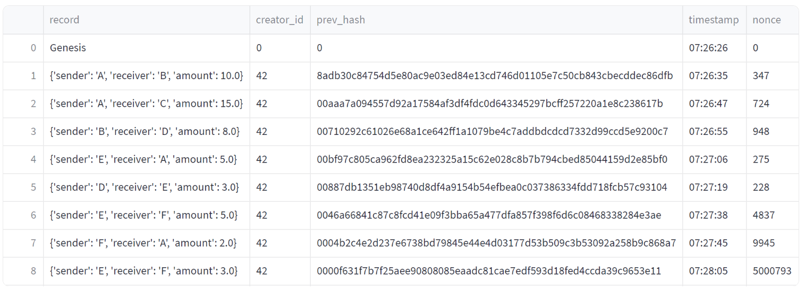
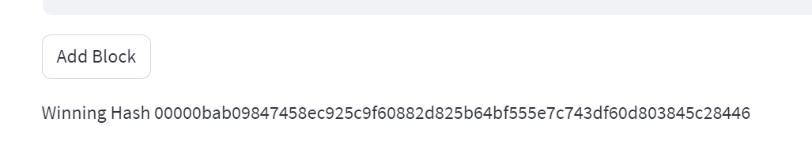
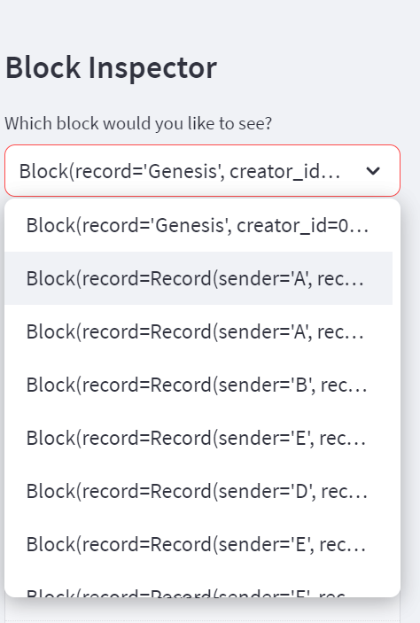
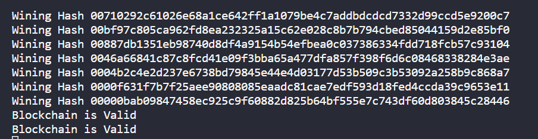
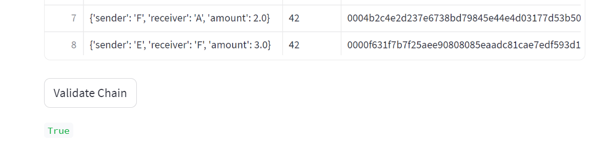

# The PyChain Ledger

This homework provides a simple implementation of a blockchain ledger, named PyChain, using Python and the Streamlit library for the user interface. The PyChain ledger allows for the recording of transactions (sender, receiver, and amount), encapsulated in the blocks of the chain.

## Overview

- **Record Data Class**: The implementation begins with a data class, `Record`, with attributes `sender`, `receiver`, and `amount` to formalize the structure of a transaction. 

- **Block Data Class Modification**: The `Block` class is then adjusted to accommodate an instance of `Record` replacing the original `data` attribute. This alteration enables each block in the PyChain to encapsulate a transaction record.

- **User Interface with Streamlit**: The user interface created with Streamlit captures transaction details, including `sender`, `receiver`, and `amount`, and enables the addition of new blocks to the PyChain via an "Add Block" button.

- **Testing the PyChain Ledger**: The integrity of the PyChain ledger can be validated using the user interface. To run the application, navigate to the project folder in the terminal and execute `streamlit run pychain.py`. User inputs and blockchain validation can be tested directly from the web interface.

For a detailed view of the blockchain and its validation, please refer to the [**Homework App link**](https://homeworkmodule18.streamlit.app/) or  and provided screenshots.

